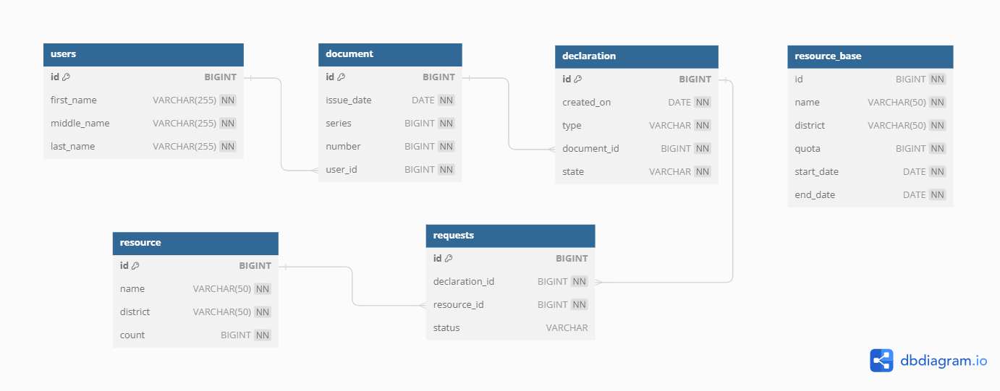

Приложение для автоматического распределения заявок на добычу охотничьих ресурсов 
============
### Описание

Добавление пользователем заявок 
# Пример заявки:
JSON
#####
<tab><tab>code/text here{"firstName": "user","middleName" : "middle","lastName" : "last","type" : "DRAW","issueDate" : "2023-10-23","series" : 22,"number" : 12345678,"requests":[{"district" : "санкт-петербург","name" : "гусь", "count" : 3},{"district" : "московская область","name" : "кабан","count" : 1}]}

Далее автоматическая проверка заявок с определенным временным интервалом.

## Endpoints

- `[POST] /declaration` – создать новую заявку
- `[PATCH] /check/start` – запустить автоматическую проверку заявок
- `[PATCH] /check/stop` – отсановить автоматическую проверку заявок

## Схема базы данных

